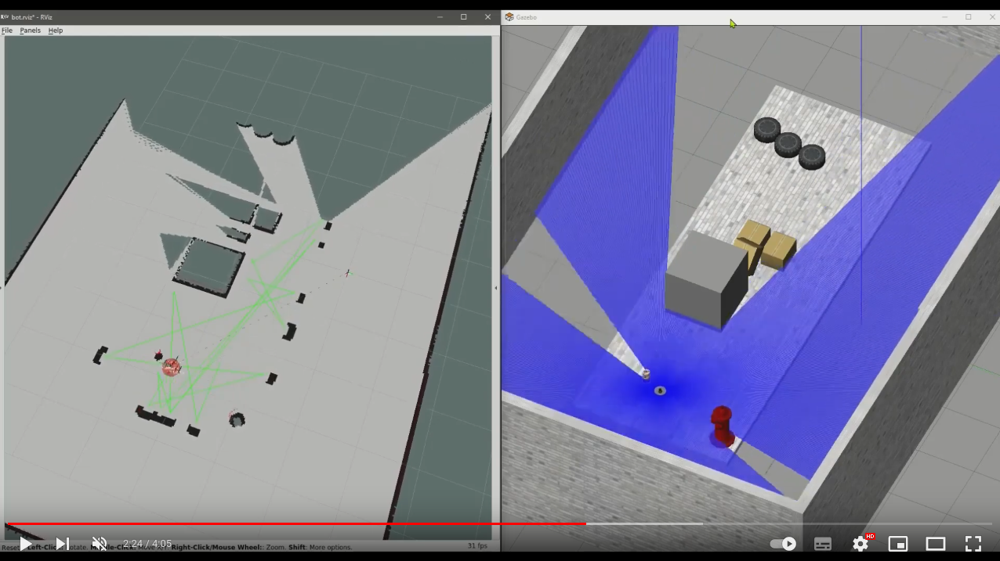
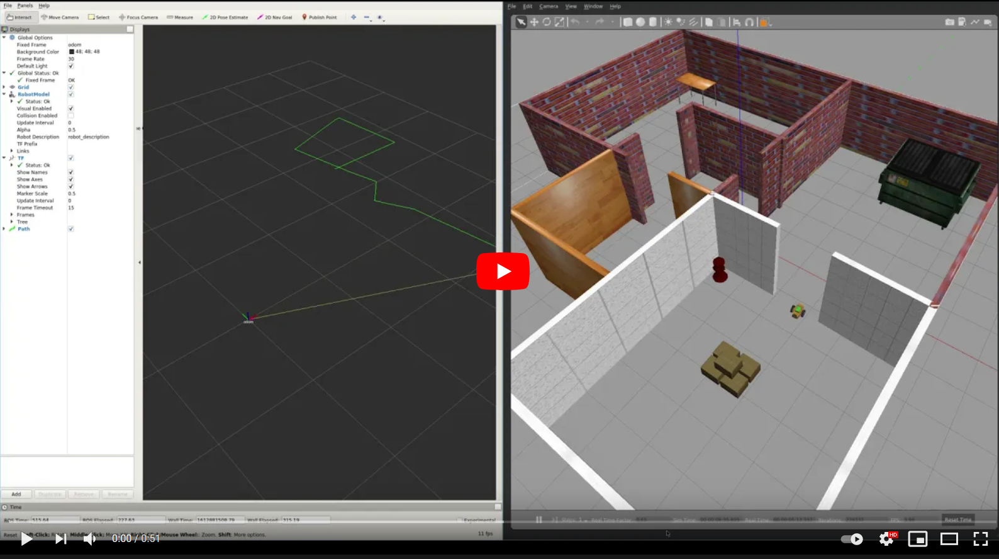
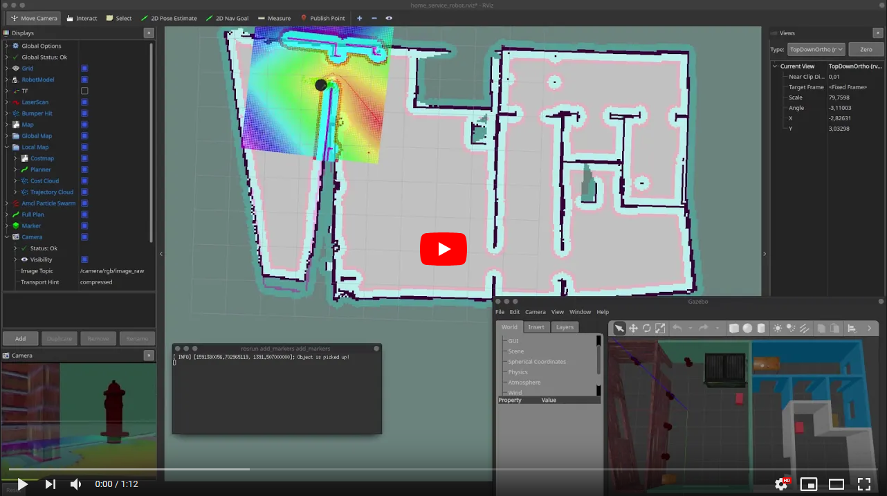
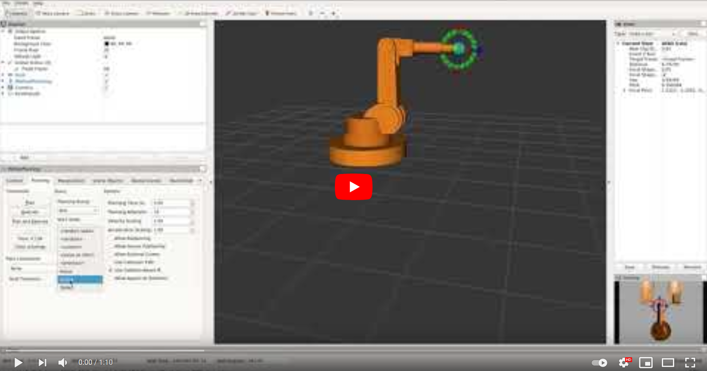

[//]: # (Image References)

[image1]: ./assets/markdown.svg "Markdwonn"
[image2]: ./assets/terminator.png "Terminator"
[image3]: ./assets/vcxsrv_1.png "VcXsrv"
[image4]: ./assets/vcxsrv_2.png "VcXsrv"
[image5]: ./assets/vcxsrv_3.png "VcXsrv"
[image6]: ./assets/rqt_1.png "rqt"
[image7]: ./assets/rqt_2.png "rqt"
[image8]: ./assets/rqt_3.png "rqt"
[image9]: ./assets/rqt_4.png "rqt"  
[image10]: ./assets/custom_publisher_1.png "custom publisher" 
[image11]: ./assets/custom_publisher_2.png "custom publisher" 
[image12]: ./assets/custom_publisher_3.png "custom publisher" 
[image13]: ./assets/custom_publisher_4.png "custom publisher" 
[image14]: ./assets/turtlesim_1.png "turtlesim" 
[image15]: ./assets/turtlesim_2.png "turtlesim" 
[image16]: ./assets/turtlesim_3.png "turtlesim"
[image17]: ./assets/turtlesim_4.png "turtlesim" 
[image18]: ./assets/turtlesim_5.png "turtlesim" 
[image19]: ./assets/turtlesim_6.png "turtlesim" 
[image20]: ./assets/turtlesim_7.png "turtlesim" 
[image21]: ./assets/turtlesim_8.png "turtlesim" 
[image22]: ./assets/hw_1.png "homework"
[image23]: ./assets/hw_2.png "homework"
[image24]: ./assets/hw_3.png "homework"
[image25]: ./assets/hw_4.png "homework"
[image26]: ./assets/hw_5.png "homework"

# 1. - 2. hét - bevezetés


## Hova fogunk eljutni a félévben?

### Korábbi Házi feladatok

<a href="https://www.youtube.com/watch?v=uLRQJh-y9AU"></a>

### A félév első fele: mobil robotok, szenzorok, aktuátorok szimulációja. Térképezés, lokalizáció és navigáció:  
  <a href="https://www.youtube.com/watch?v=YRHxixKr6r4"></a>  
  <a href="https://www.youtube.com/watch?v=L2L7snV4sCs"></a>  


### A második fele: robotkarok szimulációja és mozgatása, direkt és inverz kinematika:  
  <a href="https://www.youtube.com/watch?v=AK4aVfQVkVA"></a>  
  <a href="https://www.youtube.com/watch?v=mm2vKYH-Jy8"></a>  

### A tárgy teljesítése: csoportos (3, max 4 fő) házifaladat!

  Házi feladat ötletek:

  - TurtleBot3 Burger  
  ![alt text][image22]  

  - Mecanum kerekű robot  
  ![alt text][image26] 

  - OpenMANIPULATOR-X  
  ![alt text][image23]  

  - UR3  
  ![alt text][image24]  

  - Telemanipulátor  
  ![alt text][image25]  

  A házifeladatok kiadása: 5. héten  
  Határidő: 14. hét  
    - Projektfeladat
    - Dokumentáció (GitHub + Markdown)
    - Prezentáció 15+5 percben

# Tartalomjegyzék
1. [Mi is az a ROS?](#Mi-is-az-a-ROS?)
2. [Milyen szoftvereket fogunk használni?](#Milyen-szoftvereket-fogunk-használni?)
3. [ROS alapok](#ROS-alapok)  
3.1. [ROS Master](#ROS-Master)  
3.2. [ROS Node](#ROS-Node)  
3.3. [Publisher](#Publisher)  
3.4. [Subscriber](#Subscriber)  
3.5. [rqt](#rqt)  
3.5. [Launchfile](#Launchfile)  
3.5. [Services](#Services)  
3.5. [Messages](#Messages)  
4. [Turtlesim](#Turtlesim)
5. [Saját Turtlesim node](#Saját-Turtlesim-node)


# Mi is az a ROS?
A ROS = Robot Operating System, de valójában ez nem egy operációs rendszer, hanem egy olyan middleware, melyet a robotikában széles körben alkalmaznak. Nyíltforráskódú és könyvtárai segítségével lehetővé teszi a robot alkalmazások gyors fejlesztését. Sok előre beépített funkciót tartalmaz, amiket meg fogunk ismerni a félév során, például kamerák és más szenzorok kezelése, térképezés és útvonaltervezés, telemanipuláció, stb. Fejlesztését 2007-ben kezdte a Stanford egyetem, 2008-ban csatlakozott a fejlesztéshez a Willow Garage és 2013 óta az OSRF gondozásában, ami 2017-ben Open Robotics-ra változtatta a nevét. 2018 óta a Microsoft és az Amazon részt vesz a ROS fejlesztésében.

Ugyan a Microsoft 2018 óta érdeklődik a ROS iránt, és most már telepíthető Windows-ra is, továbbra is a Linux operációs rendszer a legelterjedtebb, ezt fogjuk használni mi is a WSL (Windows Subsystem Linux) segítségével. Bár egyre több programnyelv támogatott a C++ és Python programozási nyelvek a legelterjedtebbek ROS esetén, mi is ezeket fogjuk használni. A ROS-hoz készített alkalmazásokat/komponenseket node-oknak nevezzük, melyek közötti kommunikációt a ROS valósítja meg, mivel a kommunikáció TCP/IP alapú könnyen fejleszthetünk több, hálózatba kötött számítógépen elosztott alkalmazásokat. A robotot vezérlő ROS alkalmazás tehát sok, egymással kommunikáló node-ból épül fel. 

# Milyen szoftvereket fogunk használni?

<details>
<summary>Visual Studio Code</summary>

  - Letöltés:  
    - Windows:  
      https://code.visualstudio.com/
    - Linux:  
      Snap store-ból: `sudo snap install --classic code`
  - Javasolt extension-ök:
    - Markdown All in One
    - C/C++
    - Python
    - CMake Tools
    - ROS
    - Remote - SSH
    - Remote - WSL
</details>

<details>
<summary>Markdown</summary>

  ![alt text][image1]  
  A Markdown egy 2004-ben létrehozott, szövegek annotálására szolgáló jelölőnyelv. Könnyen olvasható és írható, fő alkalmazási területei a kollaborációs eszközök, a műszaki és tudományos publikálás. Ezt használja például a GitHub (GFM = GitHub Flavoured Markdown) is dokumentálásra, érdemes megtanulni, mert jelenleg ez a de facto standard a szakmában dokumentálásra. **Azért is érdemes megtanulni, mert ennek segítségével kell dokumentálni a házifeladatot is.** Érdemes odafigyelni, hogy a GFM esetén sok html tag nem használható! Nem lehet például átszínezni a szöveget, vagy tetszőleges méretet változtatni.

  Hasznos linkek a Markdownról:

  * https://en.wikipedia.org/wiki/Markdown
  * https://github.com/adam-p/markdown-here/wiki/Markdown-Cheatsheet
  * https://www.markdownguide.org/extended-syntax/
  * https://gist.github.com/seanh/13a93686bf4c2cb16e658b3cf96807f2

  És egy pár példa:

  * Header-ök:
    ```markdown
    # H1
    ## H2
    ### H3
    #### H4
    ##### H5
    ###### H6
    ```
  * Betűtípusok:  
    ```markdown
    *italic* vagy _italic_
    **bold** vagy __bold__
    ~~strikethrough~~
    ```
  * Listák:
    ```markdown
    Rendezett lista
    1. item
    2. item
    3. item
   
    Rendezetlen
    - item
    * item
    + item
    ```
  * Vízszintes vonal:
    ```markdown
    három vagy több
    ___
    ---
    ***
    ```
  * Programkód:
    ```markdown
    `code`
    ```
    vagy  
    ````markdown
    ```python
    s = "Python syntax highlighting"
    print(s)
    ```
    ````
  * Linkek:
    ```markdown
    [inline-style link](https://www.google.com)

    [inline-style link with title](https://www.google.com "Google's Homepage")
    ```
  * Képek
    ```markdown
    
    ```
  * Táblázatok:
    ```markdown
    A kettőspontokkal lehet igazítani az oszlop tartalmát

    | Balra         | Középre       | Jobbra |
    | ------------- |:-------------:| ------:|
    | col 3 is      | right-aligned |  $1600 |
    | col 2 is      | centered      |    $12 |
    | zebra stripes | are neat      |     $1 |
    ```

</details>

<details>
<summary>GIT</summary>

  - ### GIT parancssorból  
    A tárgy során GIT verziókezelő rendszert fogunk használni, és a házifeladatot is ebben kell megcsinálni. Regisztráció a [GitHub](https://www.github.com)-on a privát email címetekkel.  
    A legfontosabb GIT parancsok:  

    GIT repo letöltése a default branch-csel:  
    `git clone <remote-repo-url>`  
    GIT repo letöltése a kiválasztott branch-csel:  
    `git clone -b <branchname> <remote-repo-url>`  
    GIT repo letöltése submodule-okkal:  
    `git clone --recurse-submodules <remote-repo-url>`  
    Lokális GIT repoban lévő fájlok állapota, kiválasztott branch  
    `git status`  
    Lokális GIT repo frissítése a szerveren történt változtatásokkal  
    `git pull`  
    Lokális fájlok hozzáadása commit-ra:  
    `git add hello.py`  
    Minden fájl hozzáadása:  
    `git add .`  
    GIT commit:  
    `git commit -m "commit message"`  
    Változások feltöltése a szerverre:  
    `git push`  
    Lokális változások törlése és a legutolsó commitra visszaállítása:  
    `git reset --hard`  
    Új branch létrehozása lokálisan:  
    `git checkout -b <branchname>`  
    Új branch feltöltése a GIT szerverre:  
    `git push --set-upstream origin <branchname>`  
    Branchek közti váltás:  
    `git switch main`  


  - ### GitKraken  
    Ha valaki nem szereti a parancssoros GIT-et, akkor javaslom a [GitKrakent](https://www.gitkraken.com/)-t.  
    Elérhető Windowsra és Linuxra is és publikus repohoz ingyenesen használható!  

</details>

<details>
<summary>Windows 11 WSL 2</summary>

A WSL (2) a Windows Subsystem for Linux (2), ez egy teljesértékű Linux kernel, amivel Linux disztribúciót, pl Ubuntu 20.04, futtathatunk a Windowson belül. A tárgy során olyan Linuxos alkalmazásokat fogunk használni, amiknek szüksége van a GPU 3D gyorsítására, ezért a WSL1 nem felel meg a célnak, de a WSL2 már igen!

A WSL telepítése:  
https://docs.microsoft.com/en-us/windows/wsl/install-win10

Az Ubuntu 20.04 elérhető a Microsoft Store-ból. A tárgy során a 20.04 használata javasolt.

</details>

<details>
<summary>XServer (VcXsrv)</summary>

Ahhoz, hogy grafikus Linux alkalmazásokat futtassunk szükségünk van egy X szerverre Windowson. Ilyen a [VcXsrv](https://sourceforge.net/projects/vcxsrv/).  

A VcXsrv konfigja:  
![alt text][image3]  
![alt text][image4]  
![alt text][image5]  

Ahhoz, hogy a WSL-ben futó Linux tudjon csatlakozni az X szerverhez, adjuk hozzá a következő pár sort a `~/.bashrc` fájlhoz a WLS-ben futó Linuxon. A `.bashrc` megnyitása nano szövegszerkesztővel:  
`cd ~`  
`nano .bashrc`  

```bash
export DISPLAY=$(awk '/nameserver / {print $2; exit}' /etc/resolv.conf 2>/dev/null):0
export LIBGL_ALWAYS_INDIRECT=
export LIBGL_ALWAYS_SOFTWARE=1
```

</details>

<details>
<summary>Terminator / Windows Terminal</summary>

A Terminator egy nagyon hasznos Linuxos terminál, ezt javaslom a tárgy használata során, mert rengeteg parancssorral fogunk dolgozni.

![alt text][image2]

A Terminator telepítése Linuxon:

  `sudo apt install terminator`

Hasznos Terminator parancsok:  
Parancssor függőleges felosztása:  
  `Ctrl+Shift+e`  
Parancssor vízszintes felosztása:  
  `Ctrl+Shift+o`  
Parancssor bezárása:  
  `Ctrl+Shift+w`  
Terminator (és az összes parancssor) bezárása:  
  `Ctrl+Shift+q`  

Windows 11 WSL2 használata esetén használhatjátok a [Windows Terminal](https://aka.ms/terminal)-t vagy a [Windows Terminal Preview](https://aka.ms/terminal-preview)-t is, ezeket is [jól be lehet állítani](https://docs.microsoft.com/en-us/windows/terminal/panes)!


</details>

<details>
<summary>ROS Noetic</summary>

  - ### A ROS telepítése  

http://wiki.ros.org/noetic/Installation

~~Ubuntu 18.04 esetén ROS Melodic~~  
Ubuntu 20.04 esetén ROS Noetic  

Telepítés során a full desktop csomagot ajánlott telepíteni, ebben a legtöbb dolog benne van, amit használni fogunk.  
`sudo apt install ros-noetic-desktop-full`

A ROS Melodic 2023-ig, a Noetic 2025-ig támogatott.  

A ROS telepítése után minden terminálban be kell tölteni a környezetet, ha használni akarjuk a  
`source /opt/ros/noetic/setup.bash`  
segítségével. Ha csak egy ROS disztribúciót használunk a gépen, akkor érdemes ezt betenni a `./bashrc` fájlba, akkor nem kell többet kézzel betölteni a ROS alap környezetét.
  
  - ### Catkin workspace parancsok

A catkin workspace fordítása:  
`catkin_make`  

Új csomag létrehozása a catkin workspace-ben:  
`catkin_create_pkg PACKAGE DEPENDENCY1 DEPENDENCY2 ...`  

Hozzunk létre egy catkin workspace-t, ehhez a catkin_make-et fogjuk használni:  
`cd ~`  
`mkdir -p catkin_ws/src`  
`cd catkin_ws`  
`catkin_make`  

A catkin workspace környezetet minden terminálban be kell tölteni, ha használni akarjuk a  
`source ~/catkin_ws/devel/setup.bash`  
segítségével. Ha csak egy catkin workspace-t használunk, akkor érdemes ezt is betenni a `./basrc` fájlba, akkor nem kell többet kézzel betölteni a catkin workspace környezetét.

  - ### ROS parancsok

ROS master indítása:  
`roscore`  
ROS package mappájába navigálás:  
`roscd PACKAGE`  
ROS package egy adott node-jának futtatása:  
`rosrun PACKAGE NODE`  
ROS package launchfile-jának indítása:  
`roslaunch PACKAGE LAUNCHFILE`  
Aktuálisan futó ROS node-ok listája:  
`rosnode list`  
Adott (épp futó) ROS node-ról több infó:  
`rosnode info /NODE`  
ROS topicok listája:  
`rostopic list`  
Egy adott ROS topicról több infó:  
`rostopic info /TOPIC`  
Egy adott ROS topicra való feliratkozás parancssorból:  
`rostopic echo /TOPIC`  
Egy adott ROS topicra való üzenetküldés parancssorból:  
`rostopic pub /TOPIC MSG "DATA"`  

</details>
</br>


# ROS alapok

## ROS Master

A ROS Master felel az egyes node-ok regisztrációjáért, összeköti a publishereket és a subscriberek, ez írja le a teljes rendszerünk gráfját. Emellett ez tárolja a paramétereket is. Miután a ROS Master összekötötte az egyes node-okat, a node-ok peer-to-peer kommunikálnak, nem a ROS Masteren keresztül. További részletek a [wikin](http://wiki.ros.org/Master).  
A ROS Mastert a `roscore` paranccsal indítjuk el.

```console
david@DavidsLenovoX1:~/catkin_ws$ roscore
Command 'roscore' not found, but can be installed with:

sudo apt install python3-roslaunch
```

Ha a telepítés során nem tettük be a ROS környezetet a `.bashrc` fájlba, akkor minden terminál ablakban kézzel kell betölteni a környezetet:

`source /opt/ros/noetic/setup.bash`

Ezután már indíthatjuk a ROS Mastert a `roscore`-ral.

```console
david@david-precision-7520:~/bme_catkin_ws$ roscore
... logging to /home/david/.ros/log/7539c3ba-86a3-11ed-8b98-dd714a583910/roslaunch-david-precision-7520-84787.log
Checking log directory for disk usage. This may take a while.
Press Ctrl-C to interrupt
Done checking log file disk usage. Usage is <1GB.

started roslaunch server http://192.168.1.221:41289/
ros_comm version 1.15.15


SUMMARY
========

PARAMETERS
 * /rosdistro: noetic
 * /rosversion: 1.15.15

NODES

auto-starting new master
process[master]: started with pid [84802]
ROS_MASTER_URI=http://192.168.1.221:11311/

setting /run_id to 7539c3ba-86a3-11ed-8b98-dd714a583910
process[rosout-1]: started with pid [84819]
started core service [/rosout]
```

___


## ROS Node

Lépjünk be a már létrehozott catkin workspace-ünkbe:

`cd ~/catkin_ws/src`

> **_A fejezet anyagának kezdőcsomagja letölthető GIT segítségével a `starter-branch`-ről, de javasolt helyette a következő lépések (csomagkészítés, csomag kezdeti fájljainak beállítása) végigcsinálása._**  
> ```console
> git clone -b starter-branch https://github.com/MOGI-ROS/Week-1-2-Introduction-to-ROS.git
> ```


Új node-ot a `catkin_create_pkg` paranccsal tudunk létrehozni. Megadhatjuk a node-unk függőségeit a létrehozáskor:  
`catkin_create_pkg bme_ros_tutorials roscpp rospy std_msgs actionlib actionlib_msgs`  

Miután létrehoztuk a node-ot, egy üres `src` és `inc` mappa, illetve egy `CMakeList.txt` és egy `package.xml` fájl jön létre.

Ezek a függőségek automatikusan bekerülnek a `CMakeList.txt` és `package.xml` fájlokba, de ezeket később is felvehetjük kézzel.

A CMakeList.txt fájl:

```cmake
cmake_minimum_required(VERSION 3.0.2)
project(bme_ros_tutorials)

## Compile as C++11, supported in ROS Kinetic and newer
# add_compile_options(-std=c++11)

## Find catkin macros and libraries
## if COMPONENTS list like find_package(catkin REQUIRED COMPONENTS xyz)
## is used, also find other catkin packages
find_package(catkin REQUIRED COMPONENTS
  actionlib
  actionlib_msgs
  roscpp
  rospy
  std_msgs
)

...
```

Nyugodtan kapcsoljátok be a C++11 fordítási opciót.

```cmake
## Compile as C++11, supported in ROS Kinetic and newer
add_compile_options(-std=c++11)
```

A package.xml fájl elején adjuk meg a node készítőjének adatait és a licensz típusát. Ha saját magatoknak készítetek ROS node-okat, akkor ezekkel nem kell foglalkoznotok, de ha meg szeretnétek osztani a csomagotokat másokkal, akkor praktikus ezt kitölteni.

A licenszekről bővebben:

http://wiki.ros.org/DevelopersGuide  
https://www.ros.org/reps/rep-0140.html#license-multiple-but-at-least-one

```xml
<?xml version="1.0"?>
<package format="2">
  <name>bme_ros_tutorials</name>
  <version>0.0.1</version>
  <description>The bme_ros_tutorials package</description>

  <!-- One maintainer tag required, multiple allowed, one person per tag -->
  <!-- Example:  -->
  <!-- <maintainer email="jane.doe@example.com">Jane Doe</maintainer> -->
  <maintainer email="dudas.david@mogi.bme.hu">David Dudas</maintainer>


  <!-- One license tag required, multiple allowed, one license per tag -->
  <!-- Commonly used license strings: -->
  <!--   BSD, MIT, Boost Software License, GPLv2, GPLv3, LGPLv2.1, LGPLv3 -->
  <license>BSD</license>
```

A package.xml szintén tartalmazza a létrehozáskor megadott függőségeket.  

```xml
  <buildtool_depend>catkin</buildtool_depend>
  <build_depend>actionlib</build_depend>
  <build_depend>actionlib_msgs</build_depend>
  <build_depend>roscpp</build_depend>
  <build_depend>rospy</build_depend>
  <build_depend>std_msgs</build_depend>
  <build_export_depend>actionlib</build_export_depend>
  <build_export_depend>actionlib_msgs</build_export_depend>
  <build_export_depend>roscpp</build_export_depend>
  <build_export_depend>rospy</build_export_depend>
  <build_export_depend>std_msgs</build_export_depend>
  <exec_depend>actionlib</exec_depend>
  <exec_depend>actionlib_msgs</exec_depend>
  <exec_depend>roscpp</exec_depend>
  <exec_depend>rospy</exec_depend>
  <exec_depend>std_msgs</exec_depend>
```

Ezt azért praktikus megadni, és ha kell bővíteni a szükséges függőségekkel, hogy a ROS már fordítás előtt tudja, hogy milyen csomagokra van szükség. Ilyenkor a szükséges csomagok telepíthetők a következő paranccsal:

`rosdep install -y --from-paths src --ignore-src --rosdistro noetic -r`

Enélkül csak fordítás közben derül ki, ha valami hiányzik.

Fordítsuk le a catkin workspace-ünket az új (egyelőre még üres) csomagunkkal. Ezt a catkin workspace gyökerében tudjuk megtenni:

`cd ~/catkin_ws`

`catkin_make`

Fordítás után be kell töltsük az új környezetet, ami már tartalmazza az új csomagunkat:

`source devel/setup.bash`

A roscd paranccsal könnyen meggyőződhetünk róla, hogy a csomagunkat látja a ROS:

`roscd bme_ros_tutorials`

Hozzuk létre a basic_node.cpp fájlt a src mappában:

`cd src`

`touch basic_node.cpp`

A basic_node.cpp fájl tartalma:

```cpp
#include <ros/ros.h>

int main(int argc, char **argv) {

  // Init the node with name "basic_node"
  ros::init(argc, argv, "basic_node");
  ros::NodeHandle nh; // NodeHandle will fully initialze the node

  ros::Rate loop_rate(1); // 1Hz

  int count = 0;
  while (ros::ok()) // run the node until Ctrl-C is pressed
  {
    // print info to std out
    ROS_INFO("basic_node cpp is running. count = %d", count);

    count++;

    loop_rate.sleep(); // The loop runs at 1Hz
  }
}
```
Egészítsük ki a CMakeLists.txt fájlt, hogy tartalmazza az új futtatható kódunkat valamint töröljük a commentet a `catkin_package` parancs elől:

```cmake
###################################
## catkin specific configuration ##
###################################
## The catkin_package macro generates cmake config files for your package
## Declare things to be passed to dependent projects
## INCLUDE_DIRS: uncomment this if your package contains header files
## LIBRARIES: libraries you create in this project that dependent projects also need
## CATKIN_DEPENDS: catkin_packages dependent projects also need
## DEPENDS: system dependencies of this project that dependent projects also need
catkin_package(
#  INCLUDE_DIRS include
#  LIBRARIES bme_ros_tutorials
#  CATKIN_DEPENDS actionlib actionlib_msgs roscpp rospy std_msgs
#  DEPENDS message_runtime
)

...

###########
## Build ##
###########

## Specify additional locations of header files
## Your package locations should be listed before other locations
include_directories(
# include
  ${catkin_INCLUDE_DIRS}
)

add_executable(basic_node src/basic_node.cpp)
target_link_libraries(basic_node ${catkin_LIBRARIES})

```

És utána fordítsuk újra a catkin workspace-t (a workspace gyökeréből):

`cd ~/catkin_ws`  
`catkin_make`
`source devel/setup.bash`

Indítsuk el az első node-unkat a `rosrun bme_ros_tutorials basic_node` paranccsal:

```console
david@DavidsLenovoX1:~/catkin_ws$ rosrun bme_ros_tutorials basic_node 
[ERROR] [1608721117.404835100]: [registerPublisher] Failed to contact master at [172.21.233.33:11311].  Retrying...
```

Aktív ROS Master nélkül azonban nem lehet elindítani a node-okat. Indítsunk egy ROS Mastert egy másik terminál ablakban:  
`roscore`  
Ezek után el is indul a node-unk:

```console
david@DavidsLenovoX1:~/catkin_ws$ rosrun bme_ros_tutorials basic_node 
[ERROR] [1608721181.600462500]: [registerPublisher] Failed to contact master at [172.21.233.33:11311].  Retrying...
[ INFO] [1608721184.271224200]: Connected to master at [172.21.233.33:11311]
[ INFO] [1608721184.275441900]: basic_node cpp is running. count = 0
[ INFO] [1608721185.275595900]: basic_node cpp is running. count = 1
[ INFO] [1608721186.275650300]: basic_node cpp is running. count = 2
[ INFO] [1608721187.275671600]: basic_node cpp is running. count = 3
...
```
Csináljuk meg ugyanezt a példát Pythonban is a node scripts mappájában:  
`roscd bme_ros_tutorials`  
`mkdir scripts`  
`cd scripts`  
`touch basic_node.py`

A basic_node.py tartalma:

```python
#!/usr/bin/env python3

import rospy

count=0
rospy.init_node('basic_node')  # Init the node with name "basic_node"
rate = rospy.Rate(1)           # 1Hz

while not rospy.is_shutdown(): # run the node until Ctrl-C is pressed

    # print info to std out
    rospy.loginfo("basic_node python is running. count= %d",count)
    
    count+=1
    
    rate.sleep() # The loop runs at 1Hz
```

Indítsuk el a node-ot a `rosrun bme_ros_tutorials basic_node.py` paranccsal:

```console
david@DavidsLenovoX1:~/catkin_ws/src/bme_ros_tutorials$ rosrun bme_ros_tutorials basic_node.py
[rosrun] Couldn't find executable named basic_node.py below /home/david/catkin_ws/src/bme_ros_tutorials
[rosrun] Found the following, but they're either not files,
[rosrun] or not executable:
[rosrun]   /home/david/catkin_ws/src/bme_ros_tutorials/scripts/basic_node.py
```

A létrehozott fájl nem futtatható, ezért először be kell állítsuk a fájl futtathatóságát:  
`chmod +x basic_node.py`

Ezután próbáljuk meg újra elindítani.  
Ha a következő hibát látjátok az azért van, mert a fájl a Windowsnak megfelelő sorvégződéssel lett létrehozva (CRLF), ezt le kell cseréljük Unix típusú sorvégekre (LF). Ez a Visual Studio Code-ban egyszerűen megtehető a jobb alsó sarokban.

```console
david@DavidsLenovoX1:~/catkin_ws/src/bme_ros_tutorials/scripts$ rosrun bme_ros_tutorials basic_node.py
/usr/bin/env: ‘python\r’: No such file or directory
```

Vegyük észre, hogy Python kódok esetén nem kell catkin_make-et futtatnunk, legalábbis, ha ennyire egyszerű a Python kódunk. Ha vannak importált saját library-k, akkor kicsit bonyolultabb a helyzet, de ezt majd később megnézzük.

___


## Publisher

A ROS publisher adatokat küld a többi node-nak. Csak azok az node-ok kapják meg a publisher által küldött adatokat, akik feliratkoznak rá, ezek a node-ok a subscriber-ek. Hozzuk létre az első publisherünket C++-ban:

`roscd bme_ros_tutorials`

Hozzuk létre a publisher.cpp fájlt a src mappában:

`cd src`

`touch publisher.cpp`

A publisher.cpp fájl tartalma:  
```cpp
#include "ros/ros.h"
#include "std_msgs/Int32.h" // Message type used in the node

int main(int argc, char **argv) {
  // Init the node with name "publisher"
  ros::init(argc, argv, "publisher");
  ros::NodeHandle nh; // NodeHandle will fully initialze the node

  /**
   * The advertise() function is how you tell ROS that you want to
   * publish on a given topic name. This invokes a call to the ROS
   * master node, which keeps a registry of who is publishing and who
   * is subscribing. After this advertise() call is made, the master
   * node will notify anyone who is trying to subscribe to this topic name,
   * and they will in turn negotiate a peer-to-peer connection with this
   * node.  advertise() returns a Publisher object which allows you to
   * publish messages on that topic through a call to publish().  Once
   * all copies of the returned Publisher object are destroyed, the topic
   * will be automatically unadvertised.
   *
   * The second parameter to advertise() is the size of the message queue
   * used for publishing messages.  If messages are published more quickly
   * than we can send them, the number here specifies how many messages to
   * buffer up before throwing some away.
   */

  ros::Publisher pub = nh.advertise<std_msgs::Int32>("publisher_topic", 10);

  ROS_INFO(
      "Publisher C++ node has started and publishing data on publisher_topic");

  ros::Rate loop_rate(1); // 1 Hz

  std_msgs::Int32 count; // Count is now a ROS Int32 type variable that is ready
                         // to be published
  count.data = 0;        // Initializing count

  // Run the node until Ctrl+C is pressed
  while (ros::ok()) {
    pub.publish(count); // Publishing data on topic "publisher_topic"

    count.data++;
    loop_rate.sleep(); // The loop runs at 1Hz
  }
}
```

Adjuk hozzá az új node-unkat a CMakeLists.txt fájlhoz:

```cmake
add_executable(publisher src/publisher.cpp)
target_link_libraries(publisher ${catkin_LIBRARIES})
```

Fordítsuk újra a catkin workspace-t, töltsük be a környezetet és indítsuk el a node-ot!

`rosrun bme_ros_tutorials publisher`

```console
david@DavidsLenovoX1:~/catkin_ws$ rosrun bme_ros_tutorials publisher
[ INFO] [1608741335.639818400]: Publisher C++ node has started and publishing data on publisher_topic
```

Nézzük meg a `rosnode list` parancsot, látjuk a listában a publisher node-ot:

```console
david@DavidsLenovoX1:~$ rosnode list
/publisher
/rosout
```

A `rosnode info /publisher` paranccsal nézzük meg a node-unk részleteit:

```console
david@DavidsLenovoX1:~$ rosnode info /publisher
--------------------------------------------------------------------------------
Node [/publisher]
Publications: 
 * /publisher_topic [std_msgs/Int32]
 * /rosout [rosgraph_msgs/Log]

Subscriptions: None
```

Látjuk, hogy a publisher_topic-ba küld adatokat és semmire sincs feliratkozva.

Nézzük meg a topicokat is a `rostopic list` paranccsal:

```console
david@DavidsLenovoX1:~$ rostopic list
/publisher_topic
/rosout
/rosout_agg
```

Nézzük meg a publisher_topic részleteit a `rostopic info /publisher_topic` paranccsal:  

```console
david@DavidsLenovoX1:~$ rostopic info /publisher_topic
Type: std_msgs/Int32

Publishers: 
 * /publisher (http://172.21.233.33:45573/)

Subscribers: None
```

Látjuk, hogy mi az adat típusa, ki állítja elő és azt is, hogy jelenleg senki sincs feliratkozva erre az adatra.

Iratkozzunk fel az adatra parancssorból a `rostopic echo /publisher_topic` paranccsal:

```console
david@DavidsLenovoX1:~$ rostopic echo /publisher_topic
data: 564
---
data: 565
---
data: 566
---
...
```

És nézzük meg egy újabb terminálban a `rostopic info /publisher_topic`-ot:

```console
david@DavidsLenovoX1:~$ rostopic info /publisher_topic
Type: std_msgs/Int32

Publishers: 
 * /publisher (http://172.21.233.33:45573/)

Subscribers: 
 * /rostopic_4434_1608741899293 (http://172.21.233.33:46787/)
```

Láthatjuk, hogy az adatnak van egy subscriber-e, hiszen a parancssorban echozzuk az adatot.

Csináljuk meg a publisher node-unk Python változatát is `publisher.py` néven!

```python
#!/usr/bin/env python3

import rospy
from std_msgs.msg import Int32  # Message type used in the node

rospy.init_node('publisher')    # Init the node with name "publisher"

pub = rospy.Publisher('publisher_topic', Int32, queue_size=10)

rospy.loginfo("Publisher Python node has started and publishing data on publisher_topic")

rate = rospy.Rate(1)            # 1Hz

count = Int32()                 # Count is now a ROS Int32 type variable that is ready to be published

count.data = 0                  # Initializing count

while not rospy.is_shutdown():  # Run the node until Ctrl-C is pressed

    pub.publish(count)          # Publishing data on topic "publisher_topic"
  
    count.data += 1
    
    rate.sleep()                # The loop runs at 1Hz
```

Tegyük futtathatóvá, figyeljünk a sorvégekre és már indíthatjuk is a node-unkat!

`rosrun bme_ros_tutorials publisher.py`

Nézzük meg a node és topic részleteit a C++ nodehoz hasonlóan!

___

## Subscriber

A ROS subsciber adatokat fogad egy vagy több publishertől. Hozzuk létre az első subscriber-ünket C++-ban:

`roscd bme_ros_tutorials`

Hozzuk létre a subscriber.cpp fájlt a src mappában:

`cd src`

`touch subscriber.cpp`

A subscriber.cpp fájl tartalma:  

```cpp
#include "ros/ros.h"
#include "std_msgs/Int32.h" // Message type used in the node

/*
"sub_cb" is the callback method of the subscriber. Argument "msg" contains the
received data with type Int32.
*/
void sub_cb(const std_msgs::Int32::ConstPtr &msg) {
  ROS_INFO("Received data from publisher_topic: [%ld]", (long int)msg->data);
}

int main(int argc, char **argv) {
  // Init the node with name "subscriber"
  ros::init(argc, argv, "subscriber");
  ros::NodeHandle nh; // NodeHandle will fully initialze the node

  /**
   * The subscribe() call is how you tell ROS that you want to receive messages
   * on a given topic.  This invokes a call to the ROS
   * master node, which keeps a registry of who is publishing and who
   * is subscribing.  Messages are passed to a callback function, here
   * called chatterCallback.  subscribe() returns a Subscriber object that you
   * must hold on to until you want to unsubscribe.  When all copies of the
   * Subscriber object go out of scope, this callback will automatically be
   * unsubscribed from this topic.
   *
   * The second parameter to the subscribe() function is the size of the message
   * queue.  If messages are arriving faster than they are being processed, this
   * is the number of messages that will be buffered up before beginning to
   * throw away the oldest ones.
   */
  ros::Subscriber sub = nh.subscribe("publisher_topic", 10, sub_cb);

  ROS_INFO("Subscriber C++ node has started and subscribed to publisher_topic");

  /**
   * ros::spin() will enter a loop, pumping callbacks.  With this version, all
   * callbacks will be called from within this thread (the main one).
   * ros::spin() will exit when Ctrl-C is pressed, or the node is shutdown by
   * the master.
   */
  ros::spin();

  return 0;
}
```

Adjuk hozzá az új node-unkat a CMakeLists.txt fájlhoz:

```cmake
add_executable(subscriber src/subscriber.cpp)
target_link_libraries(subscriber ${catkin_LIBRARIES})
```

Fordítsuk újra a catkin workspace-t, töltsük be a környezetet és indítsuk el az előző publisher és az új subscriber node-ot is!

`rosrun bme_ros_tutorials publisher`  
`rosrun bme_ros_tutorials subscriber`

```console
david@DavidsLenovoX1:~/catkin_ws$ rosrun bme_ros_tutorials subscriber 
[ INFO] [1608743540.153272400]: Subscriber C++ node has started and subscribed to publisher_topic
[ INFO] [1608743573.935493500]: Received data from publisher_topic: [1]
[ INFO] [1608743574.934859200]: Received data from publisher_topic: [2]
[ INFO] [1608743575.934844800]: Received data from publisher_topic: [3]
[ INFO] [1608743576.934547200]: Received data from publisher_topic: [4]
[ INFO] [1608743577.935232600]: Received data from publisher_topic: [5]
...
```

Nézzük meg a `rosnode list` parancsot, látjuk a listában a subscriber és a publisher node-ot is:

```console
david@DavidsLenovoX1:~$ rosnode list
/publisher
/rosout
/subscriber
```

A `rostopic info /publisher_topic` alapján pedig azt is látjuk, hogy a publisher node generálja az adatot a subscriber node pedig fogyasztja:  

```console
david@DavidsLenovoX1:~$ rostopic info /publisher_topic 
Type: std_msgs/Int32

Publishers: 
 * /publisher (http://172.21.233.33:40571/)

Subscribers: 
 * /subscriber (http://172.21.233.33:41967/)
```

Csináljuk meg a Python subscriberünket subscriber.py néven:

```python
#!/usr/bin/env python3

import rospy
from std_msgs.msg import Int32 # Message type used in the node

'''
"sub_callback" is the callback method of the subscriber. Argument "msg" contains the received data.
'''
def sub_callback(msg):
    rospy.loginfo("Received data from publisher_topic: %d", msg.data)

rospy.init_node('subscriber_py') # Init the node with name "subscriber_py"

rospy.Subscriber("publisher_topic", Int32, sub_callback, queue_size=10) 

rospy.loginfo("Subscriber_py node has started and subscribed to publisher_topic")

'''
rospy.spin() simply keeps your node from exiting until the node has been shutdown.
Unlike roscpp::spin(), rospy.spin() does not affect the subscriber callback functions,
as those have their own threads.
'''
rospy.spin() 
```

Ezúttal indítsuk el a C++ publisherünket és mind a Python mind a C++ subscriberünket, ehhez már 3 terminálra lesz szükségünk (plusz a roscore)!

`rosrun bme_ros_tutorials publisher`  
`rosrun bme_ros_tutorials subscriber`
`rosrun bme_ros_tutorials subscriber.py`

Nézzük meg a `rostopic info /publisher_topic`-ot:

```console
david@DavidsLenovoX1:~$ rostopic info /publisher_topic 
Type: std_msgs/Int32

Publishers: 
 * /publisher (http://172.21.233.33:36551/)

Subscribers: 
 * /subscriber_py (http://172.21.233.33:43819/)
 * /subscriber (http://172.21.233.33:37199/)
```

Vegyük észre, hogy ezúttal más nevet adtunk a Python subscriber node-nak! Mi történne, ha azonos neve lenne mindkét node-nak?

A másodikként induló node leállítaná a már futó és azonos néven regisztrált node-ot:

```console
[ WARN] [1608744310.401095700]: Shutdown request received.
[ WARN] [1608744310.401328800]: Reason given for shutdown: [[/subscriber] Reason: new node registered with same name]
```

Próbáljuk még ki azt, hogy csak az egyik subscriberünk fut, ilyenkor nincs bejövő adat, hiszen nem fut a publisher node.
A következő paranccsal viszont a parancssorból tudunk megadott topicra adatot küldeni, publisher node futtatása nélkül!

`rostopic pub /publisher_topic std_msgs/Int32 "data: 111" -1`

```console
david@DavidsLenovoX1:~$ rostopic pub /publisher_topic std_msgs/Int32 "data: 111" -1
publishing and latching message for 3.0 seconds
```

A `-1` kapcsolónak köszönhetően csak 1 üzenetet publisholtunk, azonban megtehetjük azt is, hogy folyamatosan publisholunk megadott frekvenciával. Ezt a frekvenciát a rate `-r` kapcsoló és az utána álló szám határozza meg. Például 10 Hz-cel a következőképp publisholhatunk parancssorból:

`rostopic pub /publisher_topic std_msgs/Int32 "data: 111" -r 10`

Ctrl+C-vel tudjuk megszakítani a parancssori publisht ebben az esetben.

Ahogy ebben a példában láttuk a ROS segítségével könnyen megoldható, hogy egy C++ alapú node adatokat adjon át egy Pythonban írt node-nak, sőt nagyobb rendszerek esetén is tetszőlegesen keverhetjük a különböző nyelveken megírt node-jainkat. Ez az egyik hatalmas előnye a ROS-nak és annak, hogy nem egy hatalmas monolitikus alkalmazást fejlesztünk.

___

## rqt

Az rqt egy grafikus tool, ami nagyon hasznos a ROS üzeneteinek megjelenítésére akár táblázatos, akár grafikus formában. Az rqt Python vagy C++ pluginekkel tetszőlegesen kiegészíthető.  

Indítsunk egy ROS mastert és a korábbi  publisher node-unkat.  

Utána egy újabb terminál ablakban indítsuk el az rqt-t az `rqt` paranccsal.  

Az alap pluginek közül az egyik legfontosabb a `Topic Monitor`.  
![alt text][image6]  
A topic monitorban láthatjuk az egyes ROS topicokban közölt adatokat, a topicok adatforgalmát és frekvenciáját.  
![alt text][image7]  
Egy másik hasznos alap plugin a `Plot`.  
![alt text][image8]  
Ezzel grafikusan tudjuk ábrázolni azokat az adatainkat, amik számformátumúak.  
![alt text][image9]  

## Launchfile  

ROS node-okat nem csak a `rosrun` paranccsal tudunk indítani. Készíthetünk úgynevezett launchfile-okat. Ezek speciális XML fájlok, ahol egy launchfile-ban tetszőleges számú node-ot indíthatunk, vagy akár más launchfile-okat is elindíthatunk. Ezeket tipikusan egy node launch mappájában tartjuk, de bárhonnan indíthatók a `roslaunch` paranccsal. Arra érdemes figyelni, ha olyan launchfile-t akarunk indítani, ami nem egy node része, akkor a fájl mappájából kell indítani a `roslaunch` parancsot.

A `publisher.launch` launchfájl felépítése:

```xml
<?xml version="1.0"?>

<launch>
  <!-- Start a Python and a C++ publisher with different names -->
  <node name="publisher_p" pkg="bme_ros_tutorials" type="publisher.py" output ="screen"/>
  <node name="publisher_c" pkg="bme_ros_tutorials" type="publisher" output ="screen"/>
</launch>
```
Az `example.launch` launchfájl felépítése:
```xml
<?xml version="1.0"?>

<launch>
  <!-- Start another launchfile -->
  <include file="$(find bme_ros_tutorials)/launch/publisher.launch"/>
  <!-- Start a single subscriber node -->
  <node name="subscriber" pkg="bme_ros_tutorials" type="subscriber" output ="screen"/>
</launch>
```

Indítsuk el először a `publisher.launch` fájlt:  
`roslaunch bme_ros_tutorials publisher.launch`

Ha nincs futó ROS masterünk, akkor a launchfile indítása automatikus indít egy ROS mastert is. Bizonyosodjunk meg a publisher node-unk futásáról az `rqt` segítségével. A launchfájl két publisher node-ot indít, egy C++ és egy Python node-ot. A korábbiakban láttuk a rosrun esetén, hogy ez nem lehetséges, ha a két node-nak ugyanaz a neve. A launchfájlok esetén a node nevét megváltoztathatjuk, ebben az esetben `publisher_p` és `publisher_c`-re.

Állítsuk meg a `publisher.launch` fájlt a Ctrl+C billentyűkombinációval és indítsuk el a fenti `example.launch` fájlt:  
`roslaunch bme_ros_tutorials example.launch`

A launchfile segítégével ismét elindítottuk a ROS mastert (ha nem futott), a publishereket és a subscribert egyetlen paranccsal és egyetlen terminál ablakból!

Megjegyzés: a launch fájl nem alkalmas arra, hogy időzítve indítsunk node-okat. Alapból a ROS mentalitásába nem illeszkedik az, hogy a node-jaink indításakor számítson az időzítés, de néha előfordul ilyen. Ilyenkor készíthetünk egy bash scriptet, ami elindítja az egyes launchfile-okat megfelelően időzítve. Példa:

```bash
#!/bin/bash

# go to the root of catkin_ws and build the workspace
cd $(pwd)/../../..; catkin_make

# source catkin_ws and ros workspace
source devel/setup.bash
source /opt/ros/noetic/setup.bash

# start the launchfiles in individual terminals using xterm
xterm  -e  " roslaunch bme_ros_tutorials example1.launch" &    
sleep 5
xterm  -e  " roslaunch bme_ros_tutorials example2.launch" &    
sleep 10
xterm  -e  " roslaunch bme_ros_tutorials example3.launch"
```
___

## Services

A hagyományos publisher/subscriber kommunikáció a legtöbb esetben jó megoldás a node-jaink közötti kommunikációra, viszont ezek egyirányú több node-tól több node-hoz menő adatátvitelre alkalmasak. Elosztott robotikai rendszerekben előfordul, hogy RPC-re (Remote Procedure Call) van szükségünk, ahol egy klienstől érkező kérésre (request) a végrehajtó szerver választ (reply) is ad. A ROS service-ekről részletesen olvashattok a [ROS wiki](http://wiki.ros.org/ROS/Tutorials/WritingServiceClient%28c%2B%2B%29)-n, az ott található tutorialokon fogunk végigmenni közösen.

A service-ek request/reply üzenetpárosa a ROS-ban service (`.srv`) fájlokban van leírva, általában egy node `srv` mappájban. Ebben a fejezetben csináljunk egy olyan service-t, ami 2 egész számot vár request-ként, és a két szám összege a reply.

Hozzuk létre az `AddTwoInts.srv` fájlt:  
`roscd bme_ros_tutorials`  
`mkdir srv`  
`cd srv`  
`touch AddTwoInts.srv`  

A fájl tartalma:

```properties
int64 a
int64 b
---
int64 sum
```  

A requestet a --- szimbolum választja el a reply-tól a service létrehozásakor. Egy service tetszőleges request és tetszőleges reply paraméterrel rendelkezhet.

A service hozzáadásához módosítsuk a CMakeLists.txt fájlunkat!


```cmake
## Generate services in the 'srv' folder
# add_service_files(
#   FILES
#   Service1.srv
#   Service2.srv
# )

## Generate added messages and services with any dependencies listed here
# generate_messages(
#   DEPENDENCIES
#   actionlib_msgs#   std_msgs
# )

```

```cmake
## Generate services in the 'srv' folder
add_service_files(
  FILES
  AddTwoInts.srv
)

## Generate added messages and services with any dependencies listed here
generate_messages(
  DEPENDENCIES
  std_msgs
)
```

Ezek után fordítsuk újra a catkin workspace-ünket és adjuk hozzá a környezethez a módosításokat:  
`catkin_make`  
`source devel/setup.bash`  

Ezután a rossrv parancs segítségével megbizonyosodhatunk róla, hogy létezik a service-ünk:  
`rossrv show bme_ros_tutorials/AddTwoInts`

A válasz a service fájlunk tartalma lesz.

```console
david@DavidsLenovoX1:~/catkin_ws/src$ rossrv show bme_ros_tutorials/AddTwoInts
int64 a
int64 b
---
int64 sum
```

### C++ példa

Hozzunk létre egy `service_server.cpp` és egy `service_client.cpp` fájlt.  
A `service_server.cpp` tartalma:

```cpp
#include "bme_ros_tutorials/AddTwoInts.h"
#include "ros/ros.h"

bool add(bme_ros_tutorials::AddTwoInts::Request &req,
         bme_ros_tutorials::AddTwoInts::Response &res) {

  res.sum = req.a + req.b;

  ROS_INFO("request: x=%ld, y=%ld", (long int)req.a, (long int)req.b);
  ROS_INFO("sending back response: [%ld]", (long int)res.sum);
  return true;
}

int main(int argc, char **argv) {
  // Init the node with name "add_two_ints_server"
  ros::init(argc, argv, "add_two_ints_server");
  ros::NodeHandle nh; // NodeHandle will fully initialze the node

  // Advertise the ROS service
  ros::ServiceServer service = nh.advertiseService("add_two_ints", add);
  ROS_INFO("Ready to add two ints.");

  // Run until Ctrl+C is pressed
  ros::spin();

  return 0;
}
```
A `service_client.cpp` tartalma:

```cpp
#include "bme_ros_tutorials/AddTwoInts.h"
#include "ros/ros.h"
#include <cstdlib>

int main(int argc, char **argv) {

  // First, check number of arguments
  if (argc != 3) {
    ROS_INFO("usage: add_two_ints_client X Y");
    return 1;
  }

  // Init the node with name "add_two_ints_client"
  ros::init(argc, argv, "add_two_ints_client");
  ros::NodeHandle nh; // NodeHandle will fully initialze the node

  // Create a ROS service client
  ros::ServiceClient client =
      nh.serviceClient<bme_ros_tutorials::AddTwoInts>("add_two_ints");

  bme_ros_tutorials::AddTwoInts srv;
  // Convert arguments to long long int
  srv.request.a = atoll(argv[1]);
  srv.request.b = atoll(argv[2]);

  // Execute service call and check true or false response
  if (client.call(srv)) {
    ROS_INFO("Sum: %ld", (long int)srv.response.sum);
  } else {
    ROS_ERROR("Failed to call service add_two_ints");
    return 1;
  }

  return 0;
}
```

Adjuk hozzá az új node-okat a CMakeLists.txt-hez:

```cmake
add_executable(service_server src/service_server.cpp)
target_link_libraries(service_server ${catkin_LIBRARIES})

add_executable(service_client src/service_client.cpp)
target_link_libraries(service_client ${catkin_LIBRARIES})
```

Valamint az egyedi service-ünk miatt, adjuk hozzá a következő sorokat is a CMakeLists.txt-hez:
```cmake
add_dependencies(service_server bme_ros_tutorials_generate_messages_cpp)
add_dependencies(service_client bme_ros_tutorials_generate_messages_cpp)
```

Utána pedig fordítsuk újra a catkin workspace-ünket:  
`catkin_make`  
`source devel/setup.bash`  

Indítsunk egy ROS mastert, majd a service szerverünket:  
`rosrun bme_ros_tutorials service_server`  

És végül indítsuk el a service klienst 2 parancssori paraméterrel:  
`rosrun bme_ros_tutorials service_client 3 4`

### Python példa

Hozzunk létre egy `service_server.py` és egy `service_client.py` fájlt a scripts mappában.
Állítsuk be a fájlok futtathatóságát a `chmod +x FILE` paranccsal.

A `service_server.py` fájl tartalma:
```python
#!/usr/bin/env python3

from __future__ import print_function

from bme_ros_tutorials.srv import AddTwoInts,AddTwoIntsResponse
import rospy

def handle_add_two_ints(req):
    print("Returning [%s + %s = %s]"%(req.a, req.b, (req.a + req.b)))
    return AddTwoIntsResponse(req.a + req.b)

def add_two_ints_server():
    rospy.init_node('add_two_ints_server')
    s = rospy.Service('add_two_ints', AddTwoInts, handle_add_two_ints)
    print("Ready to add two ints.")
    rospy.spin()

if __name__ == "__main__":
    add_two_ints_server()
```

A `service_client.py` fájl tartalma:
```python
#!/usr/bin/env python3

from __future__ import print_function

import sys
import rospy
from bme_ros_tutorials.srv import *

def add_two_ints_client(x, y):
    rospy.wait_for_service('add_two_ints')
    try:
        add_two_ints = rospy.ServiceProxy('add_two_ints', AddTwoInts)
        resp1 = add_two_ints(x, y)
        return resp1.sum
    except rospy.ServiceException as e:
        print("Service call failed: %s"%e)

def usage():
    return "%s [x y]"%sys.argv[0]

if __name__ == "__main__":
    if len(sys.argv) == 3:
        x = int(sys.argv[1])
        y = int(sys.argv[2])
    else:
        print(usage())
        sys.exit(1)
    print("Requesting %s+%s"%(x, y))
    print("%s + %s = %s"%(x, y, add_two_ints_client(x, y)))
```

Fordítsuk újra a catkin workspace-ünket:  
`catkin_make`  
`source devel/setup.bash`  

Indítsunk egy ROS mastert, majd a service szerverünket:  
`rosrun bme_ros_tutorials service_server.py`  

És végül indítsuk el a service klienst 2 parancssori paraméterrel:  
`rosrun bme_ros_tutorials service_client.py 3 4`

A ROS service-eket RPC-re találták ki, ahol a request-re a reply azonnal (kis számítás után) megérkezik. Olyan esetekben, ha a requestet egy hosszú várakozás követi, például a robotunk A-ból B-be mozog, akkor ROS action-öket érdemes használni. A ROS action-ökre nem térünk most ki részletesen, ezeket elég ritkán használjuk, és a ROS wiki segít, ha ilyet szeretnénk csinálni.
___

## Messages

A ROS számos üzenettípust támogat alapból, számok, stringek, tömbök egyszerűen küldhetők, sőt rengeteg speciális üzenettípus van a különböző szenzorok kezeléséhez is, pl. IMU, Lidar, kamera. Bizonyos esetben előfordulhat, hogy saját egyedi üzeneteket szeretnénk használni, ilyenkor létrehozhatjuk a saját üzenetformátumunkat. Erről további részleteket találhattok a [ROS wiki](http://wiki.ros.org/ROS/Tutorials/CreatingMsgAndSrv)-n.

Hozzuk létre a saját üzenettípusunkat a `Test.msg` fájlban, amit jellemzően az `msg` mappában tárolunk a node-on belül.

`mkdir msg`  
`cd msg`  
`touch Test.msg`  

A `Test.msg` fájl tartalma:

```properties
string first_name
string last_name
uint8 age
uint32 score
```

Saját üzenetek esetén ki kell egészítenünk a `package.xml` fájlunkat:  

```xml
<build_depend>message_generation</build_depend>
<exec_depend>message_runtime</exec_depend>
```

És a `CMakeLists.txt`-t is:

```cmake
find_package(catkin REQUIRED COMPONENTS
  actionlib
  actionlib_msgs
  roscpp
  rospy
  std_msgs

  message_generation
)

...

catkin_package(
#  INCLUDE_DIRS include
#  LIBRARIES bme_ros_tutorials
#  CATKIN_DEPENDS actionlib actionlib_msgs roscpp rospy std_msgs
  DEPENDS message_runtime
)

```

```cmake
## Generate messages in the 'msg' folder
# add_message_files(
#   FILES
#   Message1.msg
#   Message2.msg
# )
```

```cmake
## Generate messages in the 'msg' folder
add_message_files(
  FILES
  Test.msg
)
```

A szokásos módon fordítsuk újra a catkin workspace-t:  
`catkin_make`  
`source devel/setup.bash`

A rosmsg paranncsal ellenőrízhetjük az üzenetünket:

`rosmsg show bme_ros_tutorials/Test`

Készítsünk olyan C++ és Python publisher node-ot, ami ezt a saját üzenetünket küldi.

### C++ publisher:

Hozzunk létre egy `publisher_custom.cpp` fájlt az `src` mappában.

A `publisher_custom.cpp` tartalma:
```cpp
#include "bme_ros_tutorials/Test.h" // Our custom message type used in the node
#include "ros/ros.h"

int main(int argc, char **argv) {
  // Init the node with name "publisher_custom"
  ros::init(argc, argv, "publisher_custom");
  ros::NodeHandle nh; // NodeHandle will fully initialze the node

  // Advertise the ROS topic
  ros::Publisher pub =
      nh.advertise<bme_ros_tutorials::Test>("publisher_custom_topic", 10);

  ROS_INFO("Custom publisher C++ node has started and publishing data on "
           "publisher_custom_topic");

  ros::Rate loop_rate(5); // 5 Hz

  bme_ros_tutorials::Test test_message;
  // test_message is now our custom ROS Test type variable
  // that is ready to be published

  // assign default values to the message fields
  test_message.first_name = "David"; // Initializing first name string
  test_message.last_name = "Dudas";  // Initializing last name string
  test_message.age = 34;             // Initializing age
  test_message.score = 0; // Initializing score that we'll increment later

  while (ros::ok()) // Run the node until Ctrl-C is pressed
  {
    // Publishing data on topic "publisher_custom_topic"
    pub.publish(test_message);

    test_message.score++;
    loop_rate.sleep(); // The loop runs at 5Hz
  }
}
```

Adjuk hozzá az új node-ot a CMakeLists.txt-hez:

```cmake
add_executable(publisher_custom src/publisher_custom.cpp)
target_link_libraries(publisher_custom ${catkin_LIBRARIES})
```

Valamint az egyedi message-ünk miatt, adjuk hozzá a következő sort is a CMakeLists.txt-hez:
```cmake
add_dependencies(publisher_custom bme_ros_tutorials_generate_messages_cpp)
```


### Python publihser:

Hozzunk létre egy `publisher_custom.py` fájlt a `scripts` mappában.

A `publisher_custom.py` tartalma:

```python
#!/usr/bin/env python3

import rospy
from bme_ros_tutorials.msg import Test # Our custom message type used in the node

rospy.init_node('publisher_custom')    # Init the node with name "publisher_custom"

pub = rospy.Publisher('publisher_custom_topic', Test, queue_size=10)

rospy.loginfo("Custom publisher Python node has started and publishing data on publisher_custom_topic")

rate = rospy.Rate(5) # 5Hz

testMessage = Test()
testMessage.first_name = "David"
testMessage.last_name  = "Dudas"
testMessage.age        = 34
testMessage.score      = 0

while not rospy.is_shutdown(): # Run the node until Ctrl-C is pressed

    pub.publish(testMessage)   # Publishing data on topic "publisher_custom_topic"
    
    testMessage.score += 1
    
    rate.sleep()               # The loop runs at 5Hz
```

Fordítsuk újra a catkin worksapce-t és indítsunk egy ROS mastert, a C++ vagy a python node-unkat és egy rqt-t:

![alt text][image10]

Nézzük meg az üzenetünket rqt-ban!

![alt text][image11]

Az üzenetünk értelmezésekor az rqt-t hibát mutat, mivel az üzenetünk nem része az alap ROS üzenetcsomagnak így az rqt nem tudja, hogyan értelmezze a tartalmát. Ezért az rqt indítása előtt be kell töltenünk a catkin workspace-ünk környezetét:

![alt text][image12]

És most így néz ki az üzenetünk rqt-ban:

![alt text][image13]  


# Turtlesim

A Turtlesim a ROS legegyszerűbb beépített 2D-s szimulátora, ahol egy teknőst tudunk vezetni, bár elsőre nagyon különbözőnek tűnhet egy valódi mobil robothoz képest, de valójában rengeteg node használható közösen!

![alt text][image14]

Indítsunk egy ROS mastert és indítsuk el a turtlesim-et:  
`rosrun turtlesim turtlesim_node`

Nézzük meg milyen node-jai vannak a turtlesim csomagnak:
```console
david@DavidsLenovoX1:~/catkin_ws$ rosrun turtlesim 
draw_square        mimic              turtlesim_node     turtle_teleop_key
```

Indítsuk el a `draw_square` node-ot:

`rosrun turtlesim draw_square`  

![alt text][image15]

Állítsuk meg a négyzetek rajzolását Ctrl+c billentyűkombinációval.

![alt text][image16]

Nézzük meg milyen service-ek tartoznak a turtlesimhez:

```console
david@DavidsLenovoX1:~/catkin_ws$ rosnode info /turtlesim 
--------------------------------------------------------------------------------
Node [/turtlesim]
Publications: 
 * /rosout [rosgraph_msgs/Log]
 * /turtle1/color_sensor [turtlesim/Color]
 * /turtle1/pose [turtlesim/Pose]

Subscriptions: 
 * /turtle1/cmd_vel [unknown type]

Services: 
 * /clear
 * /kill
 * /reset
 * /spawn
 * /turtle1/set_pen
 * /turtle1/teleport_absolute
 * /turtle1/teleport_relative
 * /turtlesim/get_loggers
 * /turtlesim/set_logger_level


contacting node http://172.26.152.188:38877/ ...
Pid: 1794
Connections:
 * topic: /rosout
    * to: /rosout
    * direction: outbound (47251 - 172.26.152.188:34456) [17]
    * transport: TCPROS


```

További részleteket így deríthetünk ki a `clear` service-ről:
```console
david@DavidsLenovoX1:~/catkin_ws$ rosservice info /clear 
Node: /turtlesim
URI: rosrpc://172.26.152.188:47251
Type: std_srvs/Empty
Args:
```

Tisztítsuk is le a vásznat a `clear` servise segítségével:  
`rosservice call /clear`

Indítsuk el a keyboard teleop node-ot a Turtlesim-hez:  
`rosrun turtlesim turtle_teleop_key`

A nyilakkal irányíthatjuk a teknőst. Mivel a teknős egy idő után összefirkálja a vásznat bármikor letakaríthatjuk a vásznat az előző clear service-szel. Vizsgájuk most meg a `set_pen` service-t is!

```console
david@DavidsLenovoX1:~/catkin_ws$ rosservice info /turtle1/set_pen 
Node: /turtlesim
URI: rosrpc://172.26.152.188:47251
Type: turtlesim/SetPen
Args: r g b width off
```

A következő paranccsal pirosra állíthatjuk a tollat:  
`rosservice call /turtle1/set_pen 255 0 0 3 0`

Az utolsó paramétert pedig ha 1-re állítjuk kikapcsolhatjuk a tollat:  
`rosservice call /turtle1/set_pen 255 0 0 3 1`

Vizsgáljuk meg milyen ROS topicok érhetők el. Csak a ROS master, a Turtlesim és a keyboard teleop node-ok fussanak!

```console
david@DavidsLenovoX1:~/catkin_ws$ rostopic list
/rosout
/rosout_agg
/turtle1/cmd_vel
/turtle1/color_sensor
/turtle1/pose
```

Vizsgáljunk meg a `/turtle1/cmd_vel` és a `/turtle1/pose` topic-ot alaposabban!

```console
david@DavidsLenovoX1:~/catkin_ws$ rostopic info /turtle1/cmd_vel 
Type: geometry_msgs/Twist

Publishers: 
 * /teleop_turtle (http://172.26.152.188:37849/)

Subscribers: 
 * /turtlesim (http://172.26.152.188:42245/)
```

```console
david@DavidsLenovoX1:~/catkin_ws$ rostopic info /turtle1/pose
Type: turtlesim/Pose

Publishers: 
 * /turtlesim (http://172.26.152.188:42245/)

Subscribers: None
```

Tehát a `/turtle1/cmd_vel` segítségével irányítja a keyboard teleop node a szimulátort, ez egy [ROS Twist típusú üzenet](http://docs.ros.org/en/noetic/api/geometry_msgs/html/msg/Twist.html), amit általánosan arra a célra használunk, hogy egy robot mozgását írjuk le 6D-ben, két 3 elemű linear és angular vektor segítségével. A `/turtle1/pose`-t pedig a szimulátor küldi és a teknős valós idejű pozicióját, orientációját és sebességét írja le. Ez nem a [ROS alap Pose típusú üzenete](http://docs.ros.org/en/noetic/api/geometry_msgs/html/msg/Pose.html), hanem egy speciáis [Turtlesim által definiált üzenet](http://docs.ros.org/en/noetic/api/turtlesim/html/msg/Pose.html)! Mivel a Turtlesim egy 2D-s világ, ezért az orientáció leírása egyetlen szöggel, a z tengely körüli elfordulással leírható. A ROS alap Pose üzenete általánosabb, és az orentációt egy 4 elemű Quaternionnal írja le.

Indítsunk a keyboard teleop mellé egy rqt-t is! És vizsgáljuk meg ezeket az üzeneteket ott is!

![alt text][image17]

Az robot x és y koordinátáit tetszőlegesen ki is rajzolhatjuk! Erre az rqt [Multiplot](https://github.com/ANYbotics/rqt_multiplot_plugin) pluginje a legalkalmasabb, az ugyanis képes nem csak timestamp alapján ábrázolni értékeket!

![alt text][image18]
![alt text][image19]
![alt text][image20]
![alt text][image21]

A multiplot nem része az alap ROS telepítésnek, így ha nem lenne a listában, akkor így tudjuk feltelepíteni:  
`sudo apt install ros-noetic-rqt-multiplot`

Ha ezek után sincs a listában, akkor ezzel tudjuk kényszeríteni az rqt-t, hogy megtalálja a plugint:  
`rosrun rqt_multiplot rqt_multiplot --force-discover`

Utána már a listában kell lennie!

# Saját Turtlesim node

Láttuk tehát, hogy a megfelelő topicba (`/turtle1/cmd_vel`) küldött twist üzenettel tudjuk irányítani a teknőst. Láttuk azt is, hogy egy twist üzenet 2 darab 3 elemű vektorból áll, a mozgást 3 dimenzióban a `linear` a forgást, szintén 3 dimenzióban pedig az `angular` vektor írja le.

A vektorok tengelyeit a ROS konvenciója szerint úgy használjuk, hogy a robot (vagy a teknős) a `linear x` tengely mentén mozog előre és az `angular z` tengely menti forgás a robot függőleges tengely körüli forgása. A `linear x` és `angular z` kombinációja segítségével pedig tetszőleges köríven tudunk mozogni.

Írjunk tehát egy saját node-ot `draw_circle.py` néven, ami a teknőst körpályán mozgatja!  
`roscd bme_ros_tutorials`  
`cd scripts`  
`touch draw_circle.py`

```python
#!/usr/bin/env python3

import rospy
from geometry_msgs.msg import Twist      # We'll use Twist message in the node

rospy.init_node('turtlesim_draw_circle') # Init the node with name "turtlesim_draw_circle"

pub = rospy.Publisher('/turtle1/cmd_vel', Twist, queue_size=1)

rospy.loginfo("Turtlesim draw circle node has started!")

rate = rospy.Rate(20) # 20Hz

msg = Twist()
msg.linear.x  = 1
msg.angular.z = 1

while not rospy.is_shutdown(): # Run the node until Ctrl-C is pressed

    pub.publish(msg)           # Publishing twist message on topic "/turtle1/cmd_vel"
    rate.sleep()               # The loop runs at 20Hz
```

Ennél egy picit bonyolultabb, ha a node-dal fel is iratkoztok a `/turtle1/pose` topicra, és az alapján változtattok a rajzoláson, erre egy jó példa a turtlesim `draw_square` node-ja, aminek a forrása természetesen elérhető itt:  
https://github.com/ros/ros_tutorials/blob/noetic-devel/turtlesim/tutorials/draw_square.cpp


## ROS service hívás - ceruza felemelése és lerakása  

Kézzel meghívtunk az előbb pár turtlesim service-t, most tegyük ezt meg kódból!
Írjunk egy újabb saját node-ot `draw_circle_service_calls.py` néven, ami időnként felemeli majd újra lerakja a ceruzát, miközben a teknős körbe-körbe megy!  
`roscd bme_ros_tutorials`  
`cd scripts`  
`touch draw_circle_service_calls.py`

```python
#!/usr/bin/env python3

import rospy
from geometry_msgs.msg import Twist # We'll use Twist message in the node
import turtlesim.srv                # This contains the service for changing the pen
import std_srvs.srv                 # Clear service is a standard ROS service
import random

# This service call can clear the canvas
def clear():
    rospy.wait_for_service('clear')
    try:
        clear_s = rospy.ServiceProxy('clear', std_srvs.srv.Empty)
        clear_s()
        return
    except rospy.ServiceException as e:
        print("Service call failed: %s"%e)

# This service call can turn on or off the pen and change its color to a random one
def set_pen(off):
    rospy.wait_for_service('turtle1/set_pen')
    try:
        set_pen_s = rospy.ServiceProxy('turtle1/set_pen', turtlesim.srv.SetPen)
        set_pen_s(random.randint(0,255),random.randint(0,255),random.randint(0,255),3,off)
        return
    except rospy.ServiceException as e:
        print("Service call failed: %s"%e)

rospy.init_node('turtlesim_draw_circle_services') # Init the node with name "turtlesim_draw_circle_services"

pub = rospy.Publisher('/turtle1/cmd_vel', Twist, queue_size=1)

rospy.loginfo("Turtlesim draw circle - with service calls - node has started!")

rate = rospy.Rate(20) # 20Hz

msg = Twist()
msg.linear.x = 1
msg.angular.z = 1

counter = 0
pen_off = False
set_pen(pen_off)               # Initialize pen

while not rospy.is_shutdown(): # Run the node until Ctrl-C is pressed

    pub.publish(msg)           # Publishing twist message on topic "/turtle1/cmd_vel"

    counter+=1                 # Change pen state in every 0.5s
    if counter%10 == 0:
        pen_off = not pen_off
        set_pen(pen_off)

    rate.sleep()               # The loop runs at 20Hz
```

A service hívások esetén ezúttal nem várok response-t, mint a korábbi példák során, ennek oka, hogy ezek a service-ek, nem adnak vissza semmilyen étéket. Ezeket könnyen ellenőrízhetjük a `rossrv show` paranccsal!  

```console
david@DavidsLenovoX1:~$ rossrv show std_srvs/Empty
---

```

```console
david@DavidsLenovoX1:~$ rossrv show turtlesim/SetPen
uint8 r
uint8 g
uint8 b
uint8 width
uint8 off
---

```


# Szorgalmi feladat

Bármilyen saját node készítése a turtlesim mozgatásához. Ötletek:  

- MOGI vagy bármilyen szöveg leírása
- Feliratkozás a turtlesim pose üzenetére, és ez alapján valamilyen alakzat rajzolása
