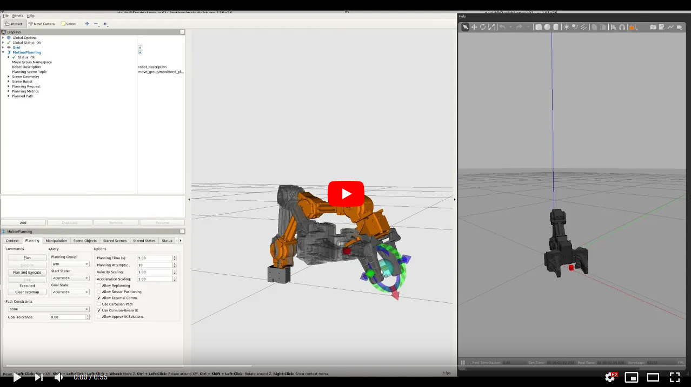

<!--style>
details > summary {
  font-size: 150%;
  padding: 4px;
  width: 600px;
  cursor: pointer;
  color:DeepSkyBlue;
}
h1 {color:DodgerBlue;}
h2 {color:DeepSkyBlue;}
</style-->

[//]: # (Image References)

[image1]: ./assets/markdown.svg "Markdwonn"
[image2]: ./assets/youtube-openmanipulator.png "YouTube - OpenMANIPULATOR-X"
[image3]: ./output_files/color_figures_test2.jpg "Color thresholds"
[image4]: ./output_files/color_th_figures_test1.jpg "S threshold"
[image5]: ./output_files/gradient_th_figures_straight_lines2.jpg "Gradient thresholds"
[image6]: ./output_files/pipeline_figures_straight_lines1.jpg "Binary result"
[image7]: ./examples/color_fit_lines.jpg "Fit Visual"
[image8]: ./examples/example_output.jpg "Output"

# 1. hét - bevezetés


## Hova fogunk eljutni a félévben?
- A félév első fele: mobil robotok, szenzorok, aktuátorok szimulációja. Térképezés, lokalizáció és navigáció:  
  <a href="https://www.youtube.com/watch?v=L2L7snV4sCs"></a>

- A második fele: robotkarok szimulációja és mozgatása, direkt és inverz kinematika:  
  <a href="https://www.youtube.com/watch?v=mm2vKYH-Jy8"></a>

 - **A tárgy teljesítése: csoportos házifaladat!**

***

## Mi is az ROS?
A ROS = Robot Operating System, de valójában ez nem egy operációs rendszer, hanem egy olyan middleware, melyet a robotikában széles körben alkalmaznak. Nyíltforráskódú és könyvtárai segítségével lehetővé teszi a robot alkalmazások gyors fejlesztését. Sok előre beépített funkciót tartalmaz, amiket meg fogunk ismerni a félév során, páldául kamerák és más szenzorok kezelése, térképezés és útvonaltervezés, telemanipuláció, stb. Fejlesztését 2007-ben kezdte a Stanford egyetem, 2008-ban csatlakozott a fejlesztéshez a Willow Garage és 2013 óta az OSRF gondozásában, ami 2017-ben Open Robotics-ra változtatta a nevét. 2018 óta a Microsoft és az Amazon részt vesz a ROS fejlesztésében.

Ugyan a Microsoft 2018 óta érdeklődik a ROS iránt, és mostmár telepíthető Windows-ra is, továbbra is a Linux operációs rendszer a legelterjedtebb, ezt fogjuk használni mi is a WSL (Windows Subsystem Linux) segítségével. Bár egyre több programnyelv támogatott a C++ és Python programozási nyelvek a legelterjedtebbek ROS esetén, mi is ezeket fogjuk használni. A ROS-hoz készített alkalmazásokat/komponenseket node-oknak nevezzük, melyek közötti kommunikációt a ROS valósítja meg, mivel a kommunikáció TCP/IP alapú könnyen fejleszthetünk több, hálózatba kötött számítógépen elosztott alkalmazásokat. A robotot vezérlő ROS alkalmazás tehét sok, egymással kommunikáló node-ból épül fel. 

***

## Milyen szoftvereket fogunk használni?

<details>
<summary>Visual Studio Code</summary>

  - Letöltés:  
    - Windows:  
      https://code.visualstudio.com/
    - Linux:  
      Snap store-ból: `sudo snap install --classic code`
  - Javasolt extension-ök:
    - Markdown All in One
    - C/C++
    - Python
    - CMake Tools
    - ROS
    - Remote - SSH
    - Remote - WSL
</details>

<details>
<summary>Markdown</summary>

  ![alt text][image1]  
  A Markdown egy 2004-ben létrehozott, szövegek annotálására szolgáló jelölőnyelv. Könnyen olvasható és írható, fő alkalmazási területei a kolaborációs eszközök, a műszaki és tudományos publikálás. Ezt használja például a GitHub (GFM = GitHub Flavoured Markdown) is dokumentálásra, érdemes megtanulni, mert jelenleg ez a de facto standard a szakmában dokumentálásra. Érdemes odafigyelni, hogy a GFM esetén sok html tag nem használható! Nem lehet például átszínezni a szöveget, vagy tetszőleges méretet változtatni.

  Hasznos linkek a Markdownról:

  * https://en.wikipedia.org/wiki/Markdown
  * https://github.com/adam-p/markdown-here/wiki/Markdown-Cheatsheet
  * https://www.markdownguide.org/extended-syntax/
  * https://gist.github.com/seanh/13a93686bf4c2cb16e658b3cf96807f2

  És egy pár példa:

  * Header-ök:
    ```markdown
    # H1
    ## H2
    ### H3
    #### H4
    ##### H5
    ###### H6
    ```
  * Betűtípusok:  
    ```markdown
    *italic* vagy _italic_
    **bold** vagy __bold__
    ~~strikethrough~~
    ```
  * Listák:
    ```markdown
    Rendezett lista
    1. item
    2. item
    3. item
   
    Rendezetlen
    - item
    * item
    + item
    ```
  * Vizszintes vonal:
    ```markdown
    három vagy több
    ___
    ---
    ***
    ```
  * Programkód:
    ```markdown
    `code`
    ```
    vagy  
    ````markdown
    ```python
    s = "Python syntax highlighting"
    print(s)
    ```
    ````
  * Linkek:
    ```markdown
    [inline-style link](https://www.google.com)

    [inline-style link with title](https://www.google.com "Google's Homepage")
    ```
  * Képek
    ```markdown
    
    ```
  * Táblázatok:
    ```markdown
    A kettőspontokkal lehet igazítani az oszlop tartalmát

    | Balra         | Középre       | Jobbra |
    | ------------- |:-------------:| ------:|
    | col 3 is      | right-aligned |  $1600 |
    | col 2 is      | centered      |    $12 |
    | zebra stripes | are neat      |     $1 |
    ```

</details>

<details>
<summary>GIT</summary>

  - ### GIT parancssorból  
    git clone <remote-repo-url>
    git clone -b <branchname> <remote-repo-url>
    git clone --recurse-submodules <remote-repo-url>
    git pull
    git add hello.py
    git add .
    git commit -m "commit message"
    git push

  - ### GitKraken  
    https://www.gitkraken.com/  
    Elérhető Windowsra és Linuxra is  
    Publikus repohoz ingyenesen használható

</details>

<details>
<summary>Windows 10 WSL 2</summary>

WSL telepítése:  
https://docs.microsoft.com/en-us/windows/wsl/install-win10

Mi a WSL? Mi a WSL2?

</details>

<details>
<summary>XServer (VcXsrv)</summary>

Letöltés:
https://sourceforge.net/projects/vcxsrv/

Képek a konfigról

Bash script a display inithez


</details>

<details>
<summary>Terminator</summary>

  `sudo apt install terminator`

  `Ctrl+Shift+e`

  `Ctrl+Shift+o`

  `Ctrl+Shift+w`

  `Ctrl+Shift+q`

</details>

<details>
<summary>ROS Melodic</summary>

  - ### A ROS telepítése
  
  - ### Catkin workspace parancsok

  - ### ROS parancsok

</details>


***
## ROS alapok

- ## ROS Master

roscore
```console
david@DavidsLenovoX1:~/catkin_ws$ roscore
Command 'roscore' not found, but can be installed with:

sudo apt install python3-roslaunch
```
source /opt/ros/noetic/setup.bash

roscore

```console
david@DavidsLenovoX1:~/catkin_ws$ roscore
... logging to /home/david/.ros/log/52a3b24e-44ff-11eb-8608-00155df615f6/roslaunch-DavidsLenovoX1-327.log
Checking log directory for disk usage. This may take a while.
Press Ctrl-C to interrupt
Done checking log file disk usage. Usage is <1GB.

started roslaunch server http://172.21.233.33:42697/
ros_comm version 1.14.9


SUMMARY
========

PARAMETERS
 * /rosdistro: melodic
 * /rosversion: 1.14.9

NODES

auto-starting new master
process[master]: started with pid [337]
ROS_MASTER_URI=http://172.21.233.33:11311/

setting /run_id to 52a3b24e-44ff-11eb-8608-00155df615f6
process[rosout-1]: started with pid [348]
started core service [/rosout]
```


- ## ROS Node

cd ~/catkin_ws/src

Új node készítése a `catkin_create_pkg` paranccsal.
`catkin_create_pkg bme_ros_tutorials roscpp rospy std_msgs actionlib actionlib_msgs`

A függőségek:

CMakeList.txt

```cmake
cmake_minimum_required(VERSION 3.0.2)
project(bme_ros_tutorials)

## Compile as C++11, supported in ROS Kinetic and newer
# add_compile_options(-std=c++11)

## Find catkin macros and libraries
## if COMPONENTS list like find_package(catkin REQUIRED COMPONENTS xyz)
## is used, also find other catkin packages
find_package(catkin REQUIRED COMPONENTS
  actionlib
  actionlib_msgs
  roscpp
  rospy
  std_msgs
)

...
```

Nyugodtan kapcsoljátok be a C++11 fordítási opciót.
```cmake
## Compile as C++11, supported in ROS Kinetic and newer
add_compile_options(-std=c++11)
```


package.xml:
```xml
<?xml version="1.0"?>
<package format="2">
  <name>bme_ros_tutorials</name>
  <version>0.0.1</version>
  <description>The bme_ros_tutorials package</description>

  <!-- One maintainer tag required, multiple allowed, one person per tag -->
  <!-- Example:  -->
  <!-- <maintainer email="jane.doe@example.com">Jane Doe</maintainer> -->
  <maintainer email="dudas.david@mogi.bme.hu">David Dudas</maintainer>


  <!-- One license tag required, multiple allowed, one license per tag -->
  <!-- Commonly used license strings: -->
  <!--   BSD, MIT, Boost Software License, GPLv2, GPLv3, LGPLv2.1, LGPLv3 -->
  <license>BSD</license>
```

http://wiki.ros.org/DevelopersGuide  
https://www.ros.org/reps/rep-0140.html#license-multiple-but-at-least-one

Függőségek:
```xml
  <buildtool_depend>catkin</buildtool_depend>
  <build_depend>actionlib</build_depend>
  <build_depend>actionlib_msgs</build_depend>
  <build_depend>roscpp</build_depend>
  <build_depend>rospy</build_depend>
  <build_depend>std_msgs</build_depend>
  <build_export_depend>actionlib</build_export_depend>
  <build_export_depend>actionlib_msgs</build_export_depend>
  <build_export_depend>roscpp</build_export_depend>
  <build_export_depend>rospy</build_export_depend>
  <build_export_depend>std_msgs</build_export_depend>
  <exec_depend>actionlib</exec_depend>
  <exec_depend>actionlib_msgs</exec_depend>
  <exec_depend>roscpp</exec_depend>
  <exec_depend>rospy</exec_depend>
  <exec_depend>std_msgs</exec_depend>
```

`rosdep install -y --from-paths src --ignore-src --rosdistro melodic -r`

cd ~/catkin_ws

catkin_make

source devel/setup.bash

roscd bme_ros_tutorials

cd src

touch basic_node.cpp

```cpp
#include <ros/ros.h>

int main(int argc, char** argv)
{
	int count = 0;
	ros::init(argc, argv, "basic_node"); // Init the node with name "basic_node"
	ros::NodeHandle nh;                  // NodeHandle will fully initialze the node
	ros::Rate loop_rate(1);              // 1Hz
	
	while (ros::ok())                    // run the node until Ctrl-C is pressed
	{
        // print info to std out
		ROS_INFO("basic_node cpp is running. count = %d", count);
			
		count++;
		
		loop_rate.sleep();                // The loop runs at 1Hz
	}
}
```


```cmake
###########
## Build ##
###########

## Specify additional locations of header files
## Your package locations should be listed before other locations
include_directories(
# include
  ${catkin_INCLUDE_DIRS}
)

add_executable(basic_node src/basic_node.cpp)
target_link_libraries(basic_node ${catkin_LIBRARIES})

```

cd ~/catkin_ws  
catkin_make

```console
david@DavidsLenovoX1:~/catkin_ws$ rosrun bme_ros_tutorials basic_node 
[ERROR] [1608721117.404835100]: [registerPublisher] Failed to contact master at [172.21.233.33:11311].  Retrying...
```

roscore

```console
david@DavidsLenovoX1:~/catkin_ws$ rosrun bme_ros_tutorials basic_node 
[ERROR] [1608721181.600462500]: [registerPublisher] Failed to contact master at [172.21.233.33:11311].  Retrying...
[ INFO] [1608721184.271224200]: Connected to master at [172.21.233.33:11311]
[ INFO] [1608721184.275441900]: basic_node cpp is running. count = 0
[ INFO] [1608721185.275595900]: basic_node cpp is running. count = 1
[ INFO] [1608721186.275650300]: basic_node cpp is running. count = 2
[ INFO] [1608721187.275671600]: basic_node cpp is running. count = 3
...
```

roscd bme_ros_tutorials  
mkdir scripts  
cd scripts  
touch basic_node.py  


```python
#!/usr/bin/env python

import rospy

count=0
rospy.init_node('basic_node')  # Init the node with name "basic_node"
rate = rospy.Rate(1)           # 1hz

while not rospy.is_shutdown(): # run the node until Ctrl-C is pressed

    # print info to std out
	rospy.loginfo("simple_node in python is running. count= %d",count)
	
	count+=1
	
	rate.sleep() # The loop runs at 1Hz
```

```console
david@DavidsLenovoX1:~/catkin_ws/src/bme_ros_tutorials$ rosrun bme_ros_tutorials basic_node.py
[rosrun] Couldn't find executable named basic_node.py below /home/david/bme_catkin_ws/src/bme_ros_tutorials
[rosrun] Found the following, but they're either not files,
[rosrun] or not executable:
[rosrun]   /home/david/bme_catkin_ws/src/bme_ros_tutorials/scripts/basic_node.py
```

chmod +x basic_node.py

```console
david@DavidsLenovoX1:~/catkin_ws/src/bme_ros_tutorials/scripts$ rosrun bme_ros_tutorials basic_node.py
/usr/bin/env: ‘python\r’: No such file or directory
```

A sorvégződések LF (Unix) legyenek CRLF (Windows) helyett!

Nem kell catkin_make-et futtatnunk, ha ennyire egyszerű a python kódunk. Ha vannak importált saját library-k, akkor kicsit bonyolultabb a helyzet, de ezt majd később megnézzük.


```cmake
###########
## Build ##
###########

## Specify additional locations of header files
## Your package locations should be listed before other locations
include_directories(
# include
  ${catkin_INCLUDE_DIRS}
)

add_executable(simple_node src/simple_node.cpp)
target_link_libraries(simple_node ${catkin_LIBRARIES})

add_executable(publisher_cpp src/cpp_publisher.cpp)
target_link_libraries(publisher_cpp ${catkin_LIBRARIES})

add_executable(subscriber_cpp src/cpp_subscriber.cpp)
target_link_libraries(subscriber_cpp ${catkin_LIBRARIES})

add_executable(service_server_node_cpp src/cpp_service_server.cpp)
target_link_libraries(service_server_node_cpp ${catkin_LIBRARIES})

add_executable(service_client_node_cpp src/cpp_service_client.cpp)
target_link_libraries(service_client_node_cpp ${catkin_LIBRARIES})

add_executable(action_server_node_cpp src/cpp_action_server.cpp)
target_link_libraries(action_server_node_cpp ${catkin_LIBRARIES})

add_executable(action_client_node_cpp src/cpp_action_client.cpp)
target_link_libraries(action_client_node_cpp ${catkin_LIBRARIES})
```


- ## Publisher

- ## Subscriber

- ## rqt

- ## Launchfile

- ## Services

- ## Actions

- ## Messages


rosnode list, rostopic list, rostopic info

***
## Turtlesim

### Twist üzenetek

### Keyboard teleop

### Hello World! Első saját ROS node-unk


http://wiki.ros.org/ROS/Introduction

http://wiki.ros.org/ROS/Tutorials